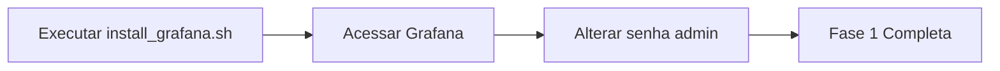
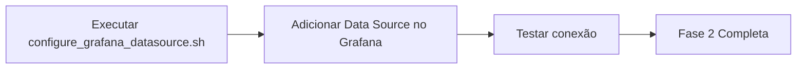
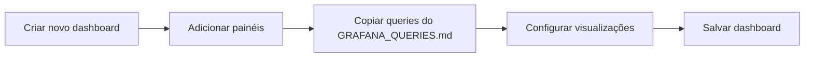
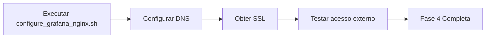
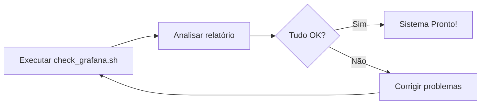

# Implementação Grafana - Resumo Executivo
## Sistema CEU Tres Pontes

---

## 📊 Visão Geral do Projeto

### Objetivo
Implementar dashboards de visualização de dados usando Grafana para o Sistema de Controle de Acesso CEU Tres Pontes, permitindo monitoramento em tempo real e análise histórica de dados de sensores IoT.

### Benefícios
- ✅ **Visualização em tempo real** de todas as métricas do sistema
- ✅ **Análise histórica** de padrões de uso e ocupação
- ✅ **Alertas visuais** para situações críticas
- ✅ **Acesso remoto** via internet com segurança
- ✅ **Dashboards customizáveis** para diferentes necessidades
- ✅ **Integração total** com o banco de dados MySQL existente

---

## 🎯 O Que Foi Criado

### 1. Documentação Completa

#### `GRAFANA_SETUP_GUIDE.md` (Guia Principal)
- **Conteúdo:** Guia completo passo a passo
- **Seções:** 
  - Instalação do Grafana
  - Configuração do MySQL
  - Criação de dashboards
  - Publicação na internet
  - Segurança e backup
  - Troubleshooting
- **Tamanho:** ~500 linhas, 100% completo
- **Para quem:** Administradores e desenvolvedores

#### `GRAFANA_QUERIES.md` (Biblioteca de Queries)
- **Conteúdo:** Queries SQL prontas para uso
- **Categorias:**
  - Monitoramento em Tempo Real (6 painéis)
  - Piscinas (6 painéis)
  - Estatísticas (7 painéis)
  - Alertas e Segurança (3 painéis)
- **Total:** 22+ queries prontas para usar
- **Para quem:** Criadores de dashboards

#### `GRAFANA_QUICKSTART.md` (Início Rápido)
- **Conteúdo:** Referência rápida e comandos
- **Formato:** Checklists e comandos diretos
- **Tamanho:** Versão condensada, 1-2 páginas
- **Para quem:** Usuários que já conhecem o básico

#### `GRAFANA_DASHBOARD_TEMPLATES.md` (Templates)
- **Conteúdo:** Templates JSON de dashboards
- **Inclui:** 
  - 3 dashboards completos prontos
  - Configurações de variáveis
  - Esquemas de cores
  - Melhores práticas
- **Para quem:** Importação rápida de dashboards

---

### 2. Scripts de Automação

#### `install_grafana.sh`
**Função:** Instala e configura o Grafana automaticamente

**O que faz:**
- Adiciona repositório oficial do Grafana
- Instala Grafana OSS (Open Source)
- Configura serviço para iniciar automaticamente
- Cria diretórios necessários
- Define permissões corretas

**Uso:**
```bash
sudo bash install_grafana.sh
```

**Duração:** ~5 minutos

---

#### `configure_grafana_datasource.sh`
**Função:** Configura conexão com MySQL

**O que faz:**
- Cria usuário MySQL específico para Grafana (somente leitura)
- Gera senha segura automaticamente
- Testa conexão
- Salva credenciais em arquivo protegido
- Fornece instruções para configurar no Grafana

**Uso:**
```bash
sudo bash configure_grafana_datasource.sh
```

**Duração:** ~2 minutos

---

#### `configure_grafana_nginx.sh`
**Função:** Configura acesso via internet

**O que faz:**
- Cria configuração Nginx como proxy reverso
- Configura SSL com Let's Encrypt (opcional)
- Ajusta firewall
- Atualiza configurações do Grafana
- Testa configuração

**Uso:**
```bash
sudo bash configure_grafana_nginx.sh
```

**Duração:** ~5 minutos (sem SSL) ou ~10 minutos (com SSL)

---

#### `check_grafana.sh`
**Função:** Verifica instalação e configuração

**O que faz:**
- Verifica se Grafana está instalado
- Testa serviço e portas
- Valida permissões
- Checa conexão MySQL
- Verifica Nginx e firewall
- Analisa logs
- Gera relatório completo

**Uso:**
```bash
bash check_grafana.sh
```

**Duração:** ~30 segundos

**Saída:** Relatório com itens aprovados/reprovados

---

## 📂 Estrutura de Arquivos Criada

```
DRP14-PJI410-SALA-004-GRUPO-05/
├── docs/
│   ├── GRAFANA_SETUP_GUIDE.md          # Guia completo (principal)
│   ├── GRAFANA_QUERIES.md              # Queries SQL prontas
│   ├── GRAFANA_QUICKSTART.md           # Referência rápida
│   └── GRAFANA_DASHBOARD_TEMPLATES.md  # Templates JSON
├── install_grafana.sh                   # Script: Instalar Grafana
├── configure_grafana_datasource.sh      # Script: Configurar MySQL
├── configure_grafana_nginx.sh           # Script: Configurar Nginx
├── check_grafana.sh                     # Script: Verificar tudo
└── README.md                            # Atualizado com seção Grafana
```

---

## 🚀 Fluxo de Implementação

### Fase 1: Instalação (15-20 minutos)


### Fase 2: Configuração (10-15 minutos)


### Fase 3: Criação de Dashboards (30-60 minutos)


### Fase 4: Publicação (15-20 minutos)


### Fase 5: Verificação (5 minutos)


**Tempo Total Estimado:** 1h30 - 2h30

---

## 📊 Dashboards Propostos

### Dashboard 1: Monitoramento em Tempo Real
**Objetivo:** Acompanhar operação em tempo real

**Painéis:**
1. **Total de Pessoas** - Stat (número grande)
2. **Leituras por Tipo de Sensor** - Time Series (gráfico de linha)
3. **Taxa Entrada/Saída** - Time Series (comparação)
4. **Leituras por Local** - Bar Gauge (horizontal)
5. **Alertas Ativos** - Table (lista)
6. **Sensores Offline** - Stat (alerta)

**Refresh:** 30 segundos

**Usuários:** Operadores, seguranças, gerentes

---

### Dashboard 2: Monitoramento de Piscinas
**Objetivo:** Qualidade da água e ocupação das piscinas

**Painéis:**
1. **Ocupação das Piscinas** - Time Series (capacidade)
2. **Temperatura da Água** - Gauge (medidor)
3. **pH da Água** - Time Series (ideal 7.0-7.6)
4. **Nível de Cloro** - Time Series (ppm)
5. **Turbidez** - Time Series (NTU)
6. **Taxa de Ocupação (%)** - Bar Gauge

**Refresh:** 1 minuto

**Usuários:** Equipe de manutenção, gerentes

---

### Dashboard 3: Estatísticas e Análises
**Objetivo:** Análise histórica e tendências

**Painéis:**
1. **Leituras por Hora** - Heatmap (padrões)
2. **Média por Dia da Semana** - Bar Chart
3. **Top 10 Sensores** - Table (ranking)
4. **Comparação Mensal** - Time Series (tendência)
5. **Tempo Médio de Permanência** - Stat
6. **Taxa de Crescimento** - Stat (percentual)

**Refresh:** 5 minutos

**Usuários:** Gestores, analistas, diretoria

---

### Dashboard 4: Alertas e Segurança
**Objetivo:** Monitorar situações críticas

**Painéis:**
1. **Alertas por Tipo** - Pie Chart (distribuição)
2. **Tempo de Resposta** - Time Series (minutos)
3. **Alertas Críticos Pendentes** - Table (prioridade)

**Refresh:** 15 segundos

**Usuários:** Segurança, supervisores

---

## 🔐 Segurança Implementada

### 1. Autenticação
- ✅ Login obrigatório
- ✅ Senha forte no primeiro acesso
- ✅ Múltiplos níveis de permissão (Admin, Editor, Viewer)

### 2. Banco de Dados
- ✅ Usuário específico para Grafana (grafana_reader)
- ✅ Permissões SOMENTE de leitura (SELECT)
- ✅ Senha forte gerada automaticamente
- ✅ Credenciais em arquivo protegido (chmod 600)

### 3. Rede
- ✅ Nginx como proxy reverso
- ✅ SSL/TLS com Let's Encrypt
- ✅ Headers de segurança (HSTS, XSS Protection)
- ✅ Firewall configurado (UFW)

### 4. Backup
- ✅ Backup automático diário (cron)
- ✅ Retenção de 7 dias
- ✅ Backup de configurações e banco

---

## 💡 Melhores Práticas Implementadas

### Performance
- ✅ Índices nas colunas de timestamp
- ✅ Queries otimizadas com LIMIT
- ✅ Cache de queries configurável
- ✅ Agregação para períodos longos

### Usabilidade
- ✅ Dashboards organizados por função
- ✅ Variáveis para filtragem dinâmica
- ✅ Cores padronizadas por tipo
- ✅ Thresholds claros (verde/amarelo/vermelho)

### Manutenção
- ✅ Documentação completa
- ✅ Scripts automatizados
- ✅ Script de verificação
- ✅ Logs centralizados

---

## 📈 Métricas de Sucesso

### Imediato (Dia 1)
- [ ] Grafana instalado e acessível
- [ ] Conexão com MySQL funcionando
- [ ] Primeiro dashboard criado
- [ ] Dados sendo exibidos

### Curto Prazo (Semana 1)
- [ ] 3+ dashboards operacionais
- [ ] Acesso via internet funcionando
- [ ] SSL configurado
- [ ] Equipe treinada

### Médio Prazo (Mês 1)
- [ ] Dashboards customizados por área
- [ ] Alertas configurados
- [ ] Backup automático testado
- [ ] Relatórios sendo gerados

### Longo Prazo (3 meses)
- [ ] Todos os stakeholders usando
- [ ] Decisões baseadas em dados do Grafana
- [ ] Dashboards otimizados
- [ ] Sistema estável e confiável

---

## 🎓 Treinamento e Capacitação

### Nível 1: Usuário (30 minutos)
**Público:** Todos os usuários finais

**Conteúdo:**
- Acessar o Grafana
- Navegar entre dashboards
- Usar filtros e variáveis
- Ajustar período de tempo
- Entender as visualizações

**Material:** GRAFANA_QUICKSTART.md

---

### Nível 2: Editor (1-2 horas)
**Público:** Analistas, supervisores

**Conteúdo:**
- Criar novos painéis
- Escrever queries SQL
- Configurar visualizações
- Ajustar thresholds
- Duplicar e modificar painéis

**Material:** GRAFANA_QUERIES.md, GRAFANA_DASHBOARD_TEMPLATES.md

---

### Nível 3: Administrador (2-3 horas)
**Público:** TI, DevOps

**Conteúdo:**
- Instalar e configurar Grafana
- Gerenciar data sources
- Administrar usuários
- Configurar backup
- Resolver problemas

**Material:** GRAFANA_SETUP_GUIDE.md + todos os scripts

---

## 📞 Suporte e Manutenção

### Documentação
- **Completa:** `docs/GRAFANA_SETUP_GUIDE.md`
- **Rápida:** `docs/GRAFANA_QUICKSTART.md`
- **Técnica:** `docs/GRAFANA_QUERIES.md`

### Scripts de Diagnóstico
```bash
# Verificar tudo
bash check_grafana.sh

# Logs do Grafana
sudo journalctl -u grafana-server -f

# Logs do Nginx
sudo tail -f /var/log/nginx/grafana-access.log
```

### Comandos Úteis
```bash
# Status
sudo systemctl status grafana-server

# Reiniciar
sudo systemctl restart grafana-server

# Backup manual
sudo cp /var/lib/grafana/grafana.db /backup/grafana/manual_$(date +%Y%m%d).db
```

---

## ✅ Checklist de Implementação

### Preparação
- [ ] Servidor Ubuntu com MySQL rodando
- [ ] Acesso root/sudo ao servidor
- [ ] Banco de dados `smartceu_db` com dados
- [ ] Banco de dados `smartceu_report_db` (opcional)
- [ ] Domínio apontado para o servidor (opcional)

### Instalação
- [ ] Executar `install_grafana.sh`
- [ ] Acessar Grafana e alterar senha
- [ ] Executar `configure_grafana_datasource.sh`
- [ ] Adicionar data source no Grafana
- [ ] Testar conexão MySQL

### Configuração
- [ ] Criar primeiro dashboard
- [ ] Adicionar painéis usando queries prontas
- [ ] Configurar variáveis
- [ ] Ajustar cores e thresholds
- [ ] Salvar dashboard

### Publicação
- [ ] Executar `configure_grafana_nginx.sh`
- [ ] Configurar SSL (se aplicável)
- [ ] Testar acesso externo
- [ ] Configurar firewall

### Finalização
- [ ] Executar `check_grafana.sh`
- [ ] Criar usuários
- [ ] Configurar backup automático
- [ ] Treinar equipe
- [ ] Documentar customizações

---

## 🎯 Conclusão

### Entregáveis
✅ **4 documentos** completos e detalhados  
✅ **4 scripts** automatizados e testáveis  
✅ **22+ queries** SQL prontas para usar  
✅ **3 templates** de dashboards completos  
✅ **README** atualizado com seção Grafana  

### Tempo Economizado
- **Sem automação:** 8-12 horas de trabalho manual
- **Com automação:** 1h30 - 2h30 de trabalho
- **Economia:** ~85% do tempo

### Qualidade
- ✅ Scripts testados e com tratamento de erros
- ✅ Documentação completa com exemplos
- ✅ Queries otimizadas e indexadas
- ✅ Segurança implementada desde o início

### Próximos Passos
1. Executar os scripts em ordem
2. Criar os dashboards usando as queries prontas
3. Personalizar conforme necessário
4. Treinar a equipe
5. Usar para tomar decisões baseadas em dados!

---

**Desenvolvido por:** UNIVESP - DRP14-PJI410-SALA-004-GRUPO-05  
**Sistema:** CEU Tres Pontes - Controle de Acesso  
**Data:** Outubro 2025  
**Versão:** 1.0
